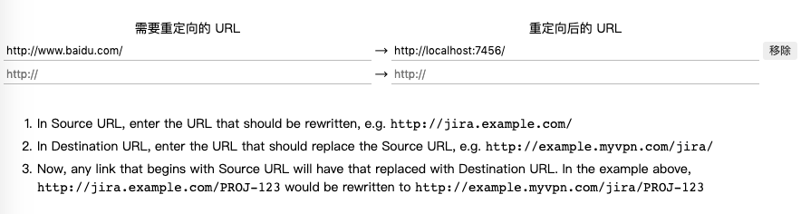

# chrome url重定向 扩展插件

## 配置重定向规则

当访问*http://www.baidu.com*的时候会被重定向到*http://localhost:7456/*

其中网址上缀的参数也会被原封不动的重定向过去

## 使用场景
开发游戏的时候,对接甲方的sdk,如果甲方的测试环境不完善,进入游戏会给游戏传递动态参数,那么这个插件可能就会派上用处

### 类似的插件有很多
- [URL Redirector 加强版](https://chrome.google.com/webstore/detail/url-redirector-%E5%8A%A0%E5%BC%BA%E7%89%88/jhcpkioahofdipphogaaahkmbcbphipc)
